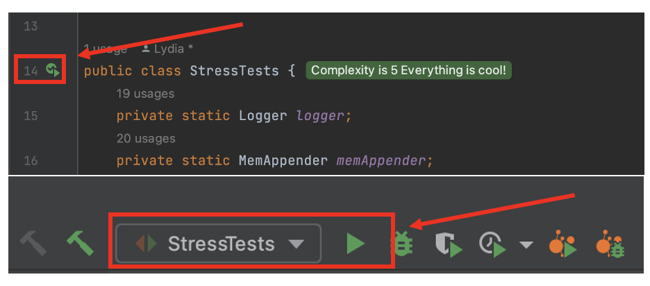

# assign251-2 159.251
## XinjieZhang, ID: 22009155

### To Run Tests:
JUnit tests can be run via the  `mvn clean test` or `mvn test`  from the 
command line or via the maven tab in your IDE. This will automatically run
all tests excluding the Console Appender Stress Tests. This was done because
with it included, the tests took far too long.

It is best to run the Console Appender Stress Tests from within your IDE. For example, within
Intellij IDEA, the tests can be run from either the gutter beside the declaration
of the class name, or by selecting and running the run configuration. An example 
of this is shown below. This can also be done for the individual tests themselves. 

### MBean JMX MBeanServer.queryMBeans
Use MBeanServer.queryMBeans(ObjectName name, QueryExp query) to get the MBean with the query expression

I can get the expected results: 
- 1 class name: tMBeanr$Hello 
- Object name: tcom.javacodegeeks.snippets.enterprise:type=Hello

Use 

-Set<ObjectInstance> instances = server.queryMBeans(new ObjectName(objectName), null)

To make a inquire.

### Reports
[performance-analysis.pdf](reports/performance-analysis.pdf) ,  [coverage.html](reports/coverage.html)  ,  [jacoco-sessions.html](reports/jacoco-sessions.html)are 
located within the `reports` directory
